# Capstone-Project-Sales-Analysis
An American based Tech Sales company wants to make use of their 2019 sales data ,to find more insights into maximizing the sales.
The Goal is to uncover actionable insights that will drive sales growth, operational efficiency, and strategic decision-making.
below are some visualisations that  describe the different aspects of the analysis and its influence on sales growth.
Univariate Analysis
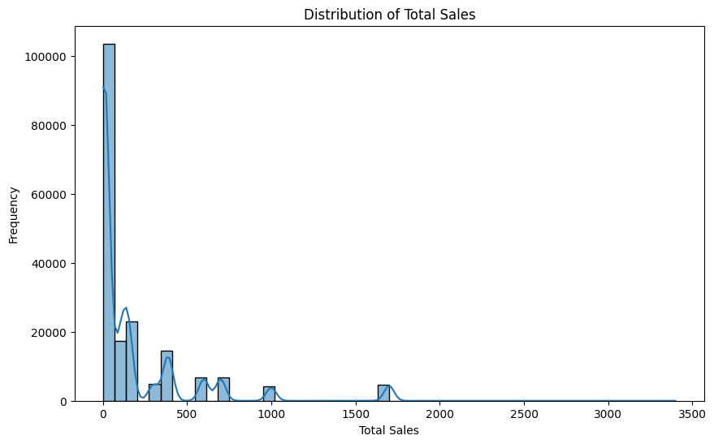
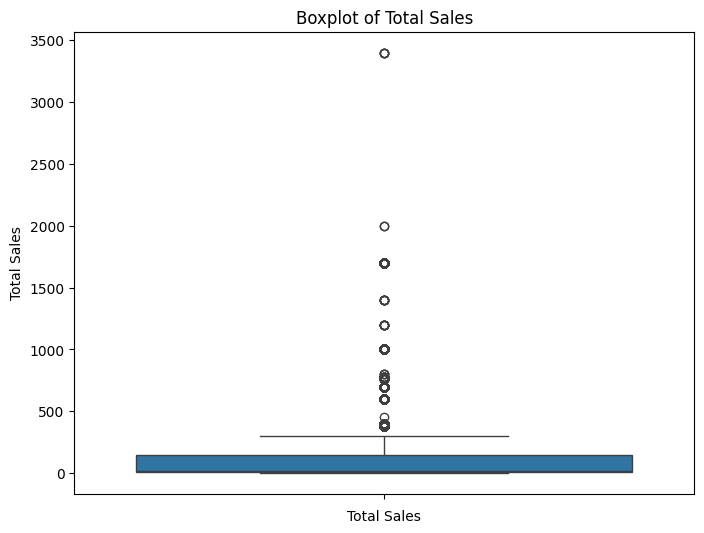
Bivaritae Analysis.
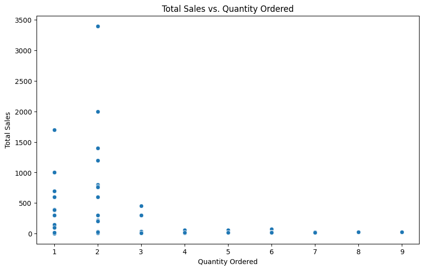
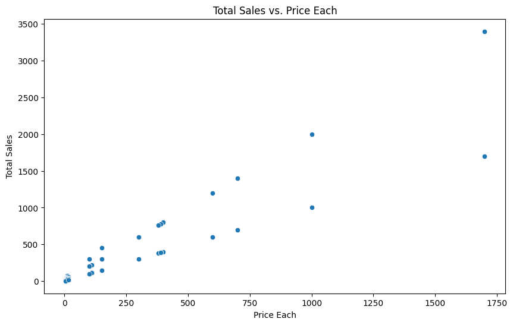
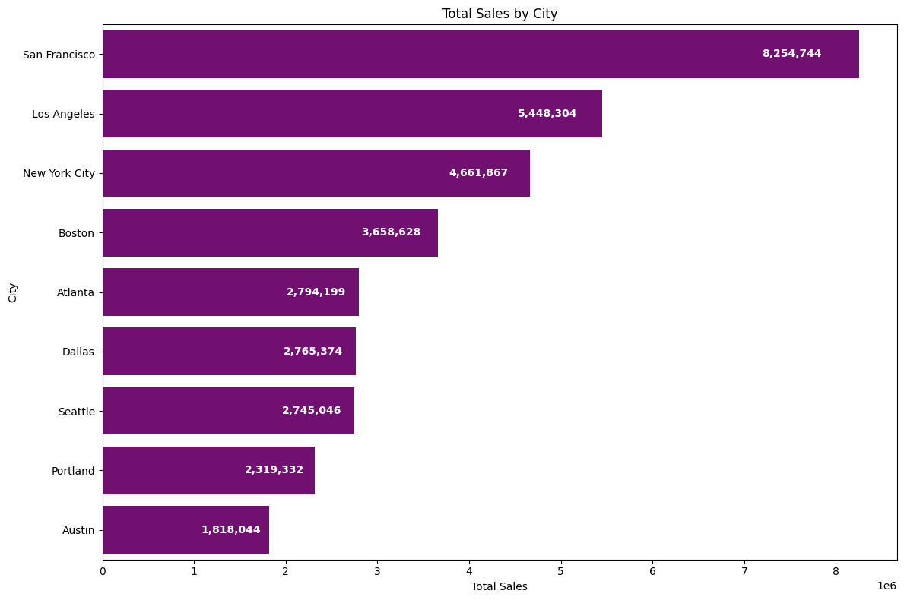
Multivariate Analysis
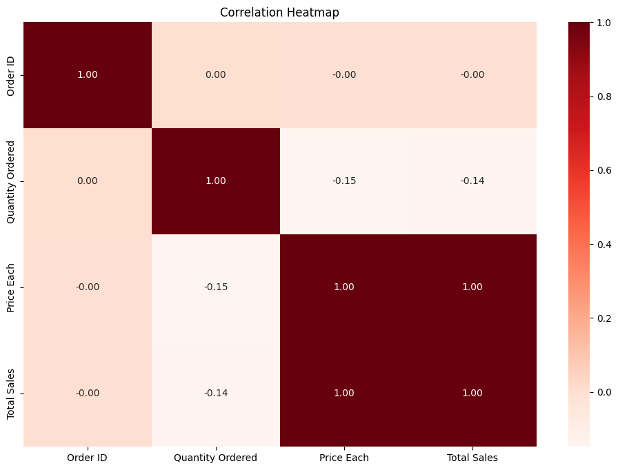
Graphs from Our Bussiness Questions
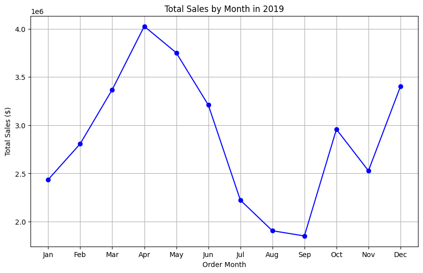
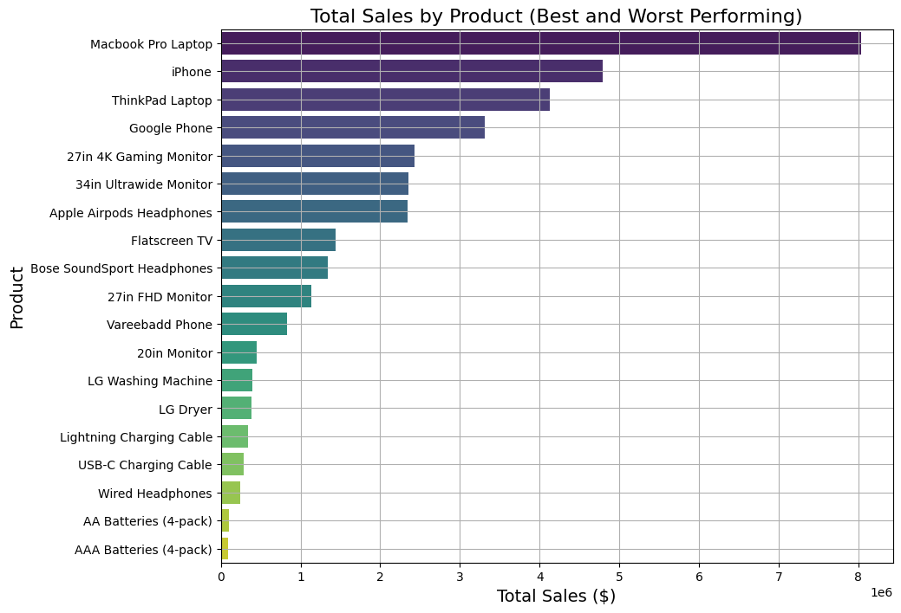
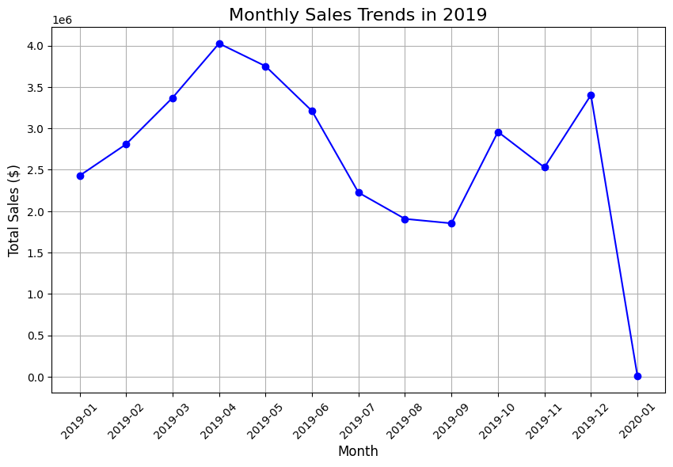
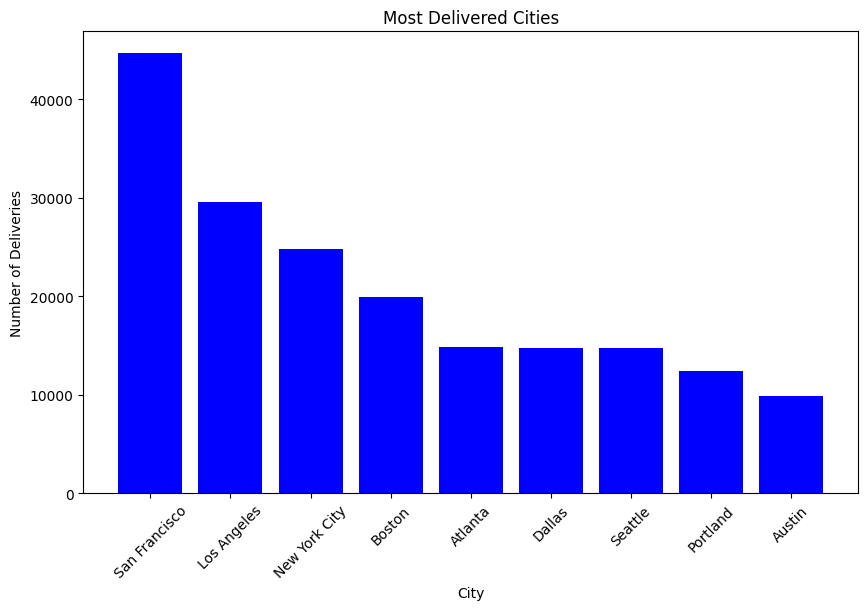
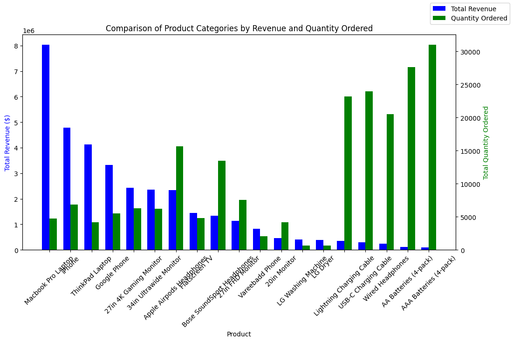
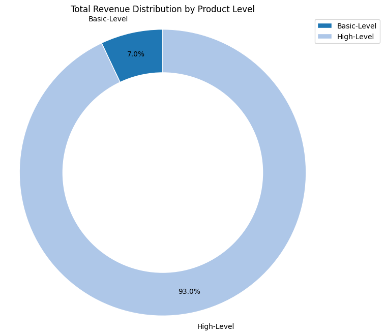
Find more deductions from the sales notebook.

thank you. 
